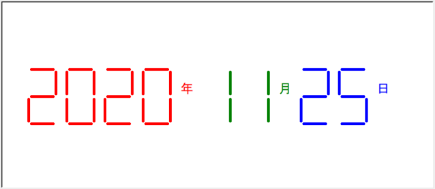

# Homeworks
## Homework Tasks:

1. "Seven-segment digital tube drawing" question: Requirement: Based on the current date, draw the following color digital tube?

2. Write a calculator for the Fibonacci sequence, which needs to calculate the sum of the Fibonacci sequence.

The definition of the Fibonacci sequence is that the first two numbers are 1 and 1, and each subsequent number is the sum of the previous two numbers. For example, the first few Fibonacci numbers are 1, 1, 2, 3, 5, 8, 13, 21, ... .

Tip: Use recursion, global variables

3. Use recursion to solve the Tower of Hanoi problem

There are three pillars (we usually call them A, B, C). On pillar A, there are 64 gold plates stacked in order of size from bottom to top (it can also be other numbers of plates). Now move all the gold disks on pillar A to pillar C, and follow the following rules:

（1）. Only one plate can be moved at a time.

（2）. Each plate can be placed on pillar B, but the plate placed on pillar B must be smaller than the plate above.

4. Recursive implementation of quick sort algorithm

Description: Write a recursive function to implement the quick sort algorithm.

Tip: Use recursion to split the list into two parts that are less than the base number and greater than the base number, and then sort the two parts recursively.

## Submission Content:

1. Submit .txt or .py files containing the source code (one file for each task).

2. Submit screenshots of the program running (one screenshot for each task) or a video demo for each task.

## Grading Criteria:

1. Functionality Completeness (50%): Whether all tasks are completed as per the requirements.

2. Code Quality (30%): Readability, modularity, appropriate use of comments, independent completion, etc.

3. Screenshots of Execution (10%): Clear and valid screenshots demonstrating the proper functioning of the program.

4. Other Criteria (10%): Timely submission, adherence to guidelines, etc.

Note: Please ensure that the submitted code and screenshots are clear and visible. Grading will be based on the completeness and quality of the assignment.